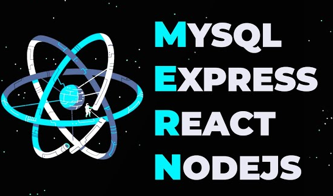
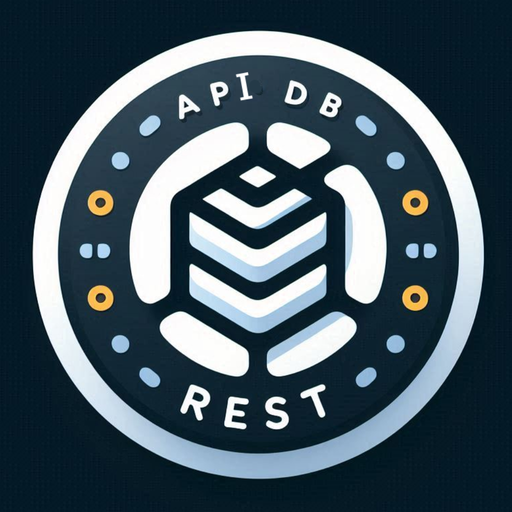

# Estructura

<h2>
    APP | MERN STACK (Server rendering)
     
    <small>
        ./
    </small>
</h2>

    

> - ### Mysql-Postgre (Server-api-driver)
> - ### Express (Server-app-gestor)
> - ### React (Server-render)
> - ### Node.js

## Extra

> - ### auth-session passport-express
> - ### socket.io (WebSockets)

Aplicación gestora de rutas para interactuar con el servidor de base de datos
y el servidor de front-end

<h2>
    CLIENT | REACT-JSX
     
    <small>
        ./app/services/client-react
    </small>
</h2>

Aplicación Front-end para desarrollar con React.

    

<h2>
    DB | POSTGRES SQL
     
    <small>
        ./app/services/db-postgresql
    </small>
</h2>

Aplicación back-end para poder administrar la base de datos desde una REST-API-JSON

    

---

# Instalación

> ## npm run install-all

Instala todas las dependencias tanto en cliente como en servidor

# Ejecución.

> ## npm run start

Ejecuta el servidor, el ciente y la aplicación de gestión de rutas.

> ## npm run dev

Ejecuta el servidor, el ciente y la aplicación de gestión de rutas.
Usa la bandera --watch en el servidor y en el gestor para refrescar cuando detecte cambios..
